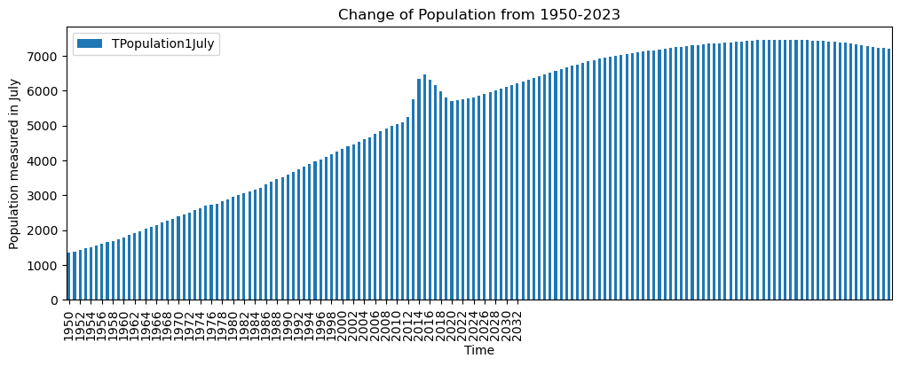
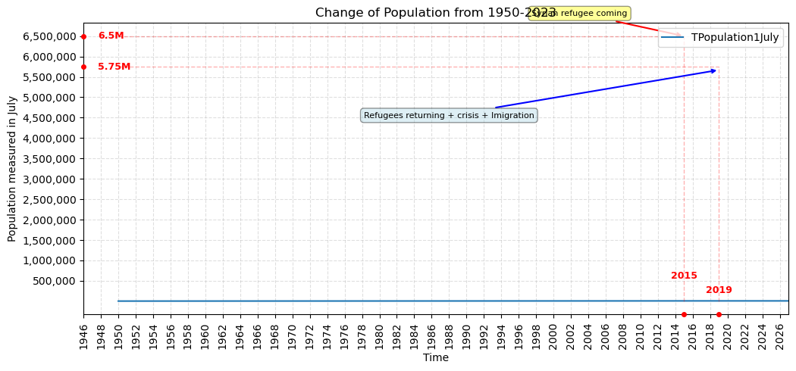
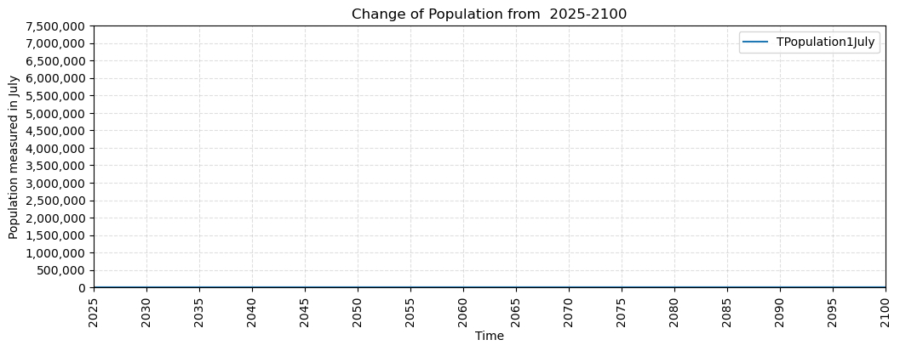
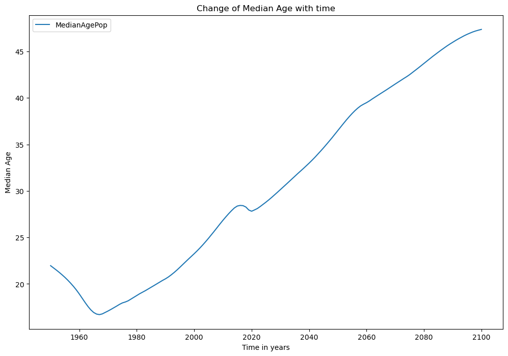
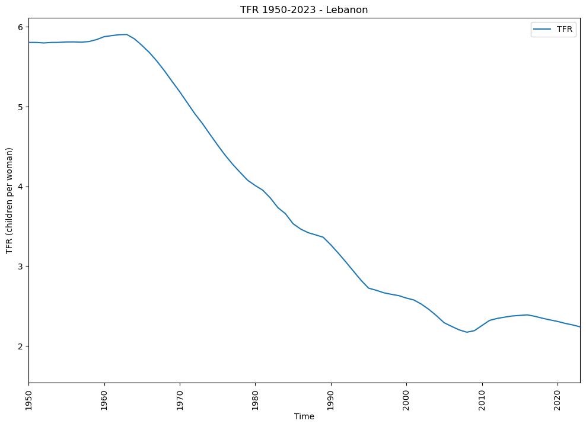
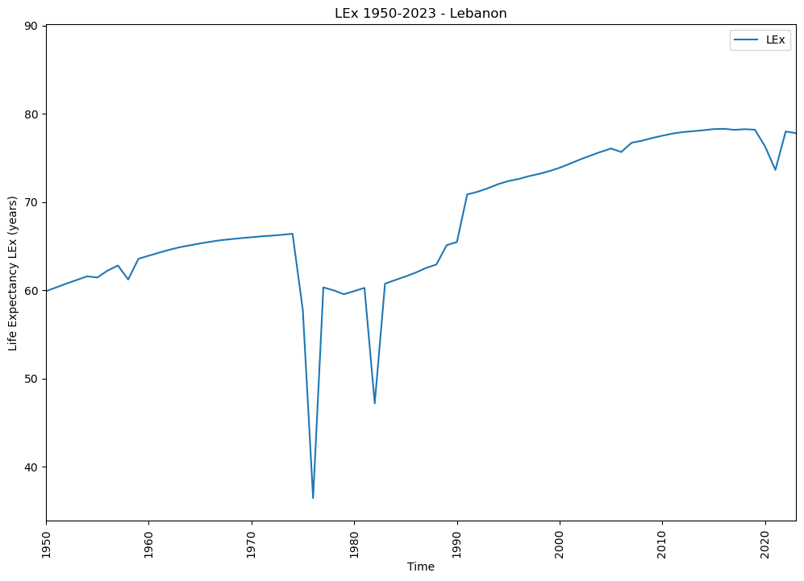
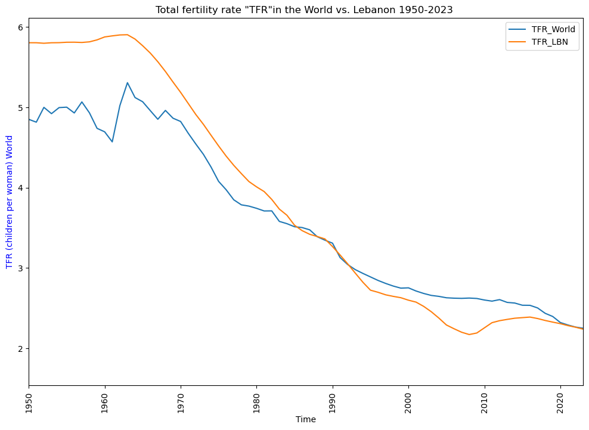
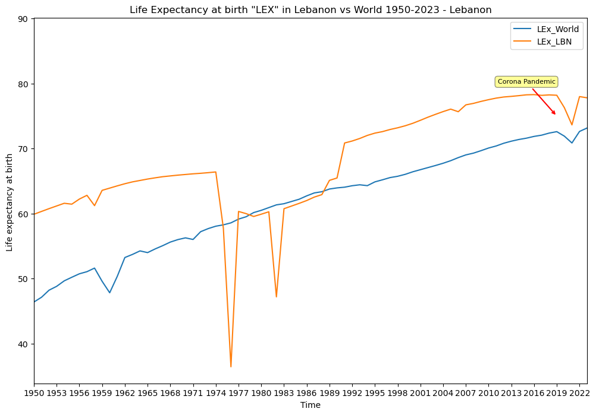
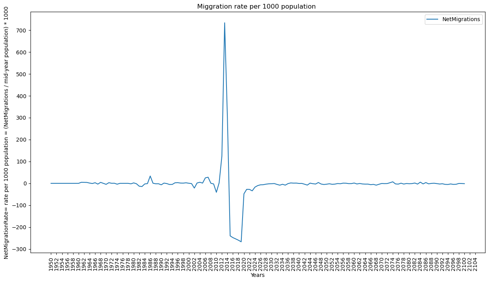

# UN-World-Population-Prospects--Lebanon-Population-Analysis

Project Title: UN World Population Prospects 2024 - Lebanon Population Analysis  

**Introduction**

This project analyzes Lebanon's demographic evolution using UN World Population Prospects 2024 (Medium Variant).

**Data Source**

Official source: https://population.un.org/wpp/

File: WPP2024_Demographic_Indicators_Medium.csv

**Main Objective**  

To analyze population trends for Lebanon using official UN WPP data, understand how Lebanon’s demographics changed from 1950 to 2023 and what the UN projects until 2100.  

**Data and Features Chosen**

  Chosen features - efficient minimal set covering demographic balancing equation:

- Time: Year 1950-2100
- TPopulation1July: Total population in thousands (mid-year)
-  PopGrowthRate: Annual growth %
-  MedianAgePop: Median age - aging indicator
-  TFR: Total Fertility Rate - average kids per woman - MOST IMPORTANT
- LEx: Life Expectancy at birth
- CBR: Crude Birth Rate - births per 1000 people
- CDR: Crude Death Rate - deaths per 1000 people
- NetMigrations: Immigrants - Emigrants (negative = people leaving)

**Specific Objectives**

To answer:

- How did Lebanon's total population change from 1950-2023 ?
 
- When was the fastest growth?
 
- Is Lebanon getting older? (MedianAgePop)
 
- How did fertility rate (TFR) drop?

- How did life expectancy (LEx) improve and why did it crash?

- How does Lebanon compare to World for Total fertility rate (TFR) and  World average rate (LEx) ?
 
- How did net migration change?

- What is the UN scenario Immigration projection for Lebanon 2030, 2050, 2100?

**Methodology**  

Tools: Python, pandas, matplotlib / plotly  
Choose Lebanon from the table of UN measurements by Filtering ISO3 = LBN, then clean, visualize  .

**Analysis and Output**  
4-6 charts (population curve, median age, fertility, life expectancy, comparison,immigration)  

### 4.1 Population Growth Analysis 1950-2023

How did Lebanon's total population change from 1950-2023? When was the fastest growth?

Here Chart 1 - Chart1_Population_growth.png

Key insight:  
1950        ~1.36M   
2016 peak   ~6.23M (including refugees)  
2023        ~5.8M. Fastest growth was in 2012-2014.

### 4.2 UN Population Projection 2030, 2050, 2100

What does UN project about populationfor 2030, 2050, 2100?

### 4.3 Age Structure Analysis

Is Lebanon getting older?

Here Chart 4 - Chart4_Median_change

Finding:  
The country is becoming older with time:  
1950             ~18y  
2023             ~31y  
2100 projected   ~45y.

### 4.4 Fertility & Life Expectancy

**Fertility Rate Per Woman: TFR**

Phase A 1950-1965 High and stable ~5.8 - Pre-transition, rural society, low contraception.  
Phase B 1965-1990 Rapid decline 5.8 -> 3.4 - Female education + Beirut urbanization, later marriage age - civil war 1975-1990 delayed family formation, contraception access.  
Phase C 1990-2008 Below replacement 3.4 -> 2.1 - Post-war, more women in workforce. Reached 2.1 around 2005.
Phase D 2008-2023 Stable low ~2.2-2.4

**Life Expectancy at Birth: LEx**

How did LEx improve? 60 to 78 years - with 2 crashes  
1950-1974: 60 -> 66 years  
CRASH 1: 1975-1976 -> 37 years - Start of Civil War  
CRASH 2: 1982 -> 46 years - Israeli invasion of Lebanon, siege of Beirut  
1990-1991: Jump 64 -> 71 years - End of civil war  
1991-2019: 71 -> 78.5 years  
CRASH 3: 2020-2021: 78.2 -> 73.5 years - COVID-19 + Beirut port explosion + economic collapse

### 4.5 Lebanon vs World Comparison
Comparing Lebanon vs World for fertility rate: TFR  
  

Comparing Lebanon vs World for Life Expectancy at birth: LEx

### 4.6 UN Projection For future net migration For Leabnon

What does UN project for future net migration for Lebanon until 2100?

