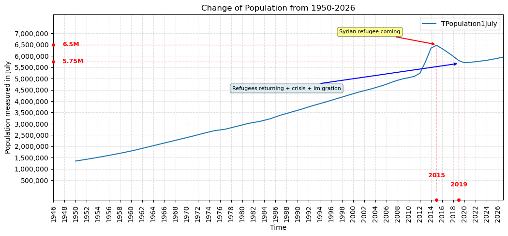
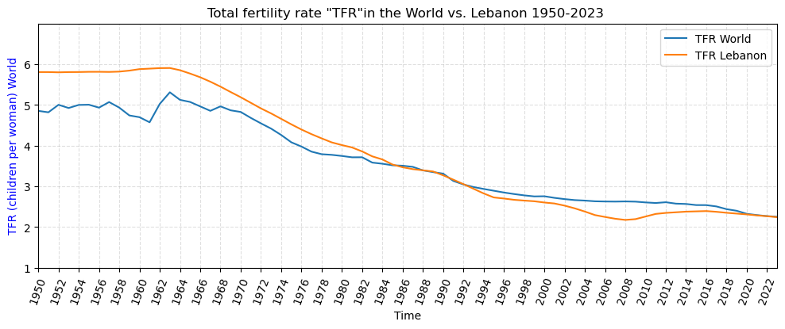
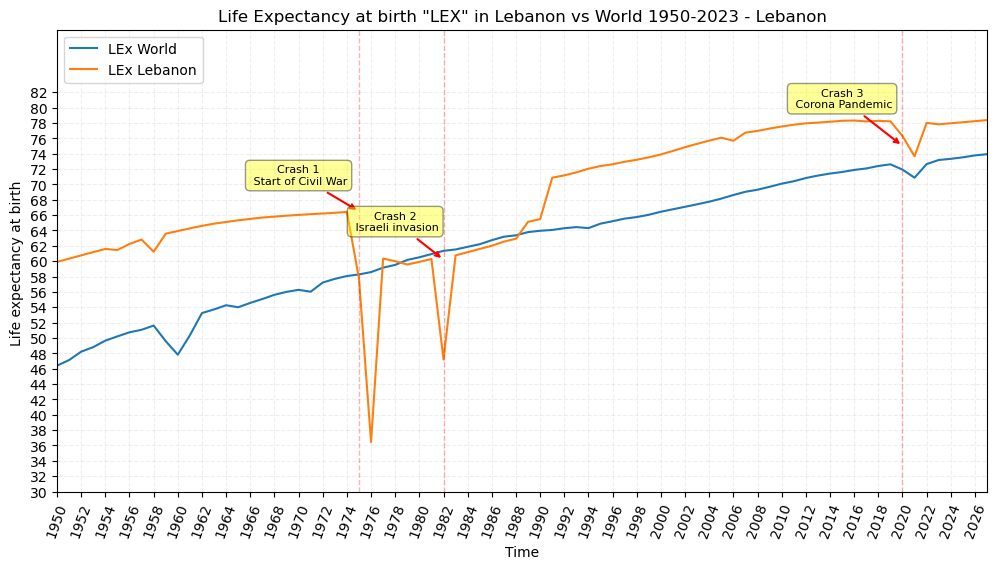
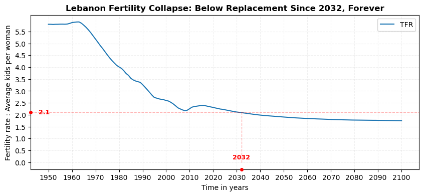
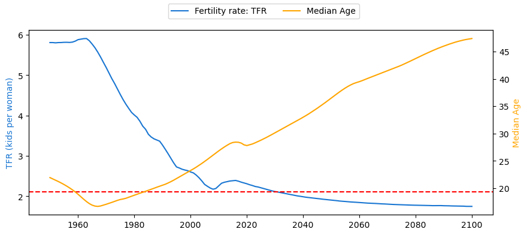
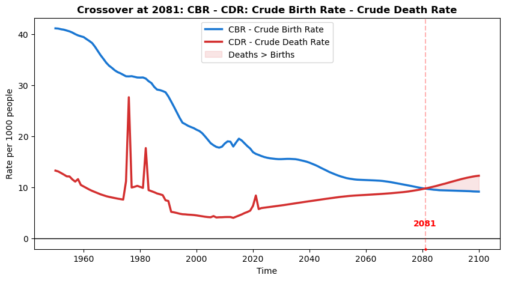
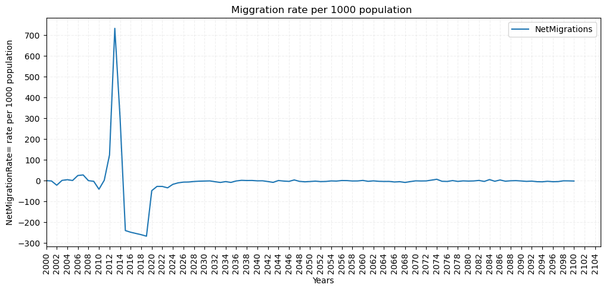
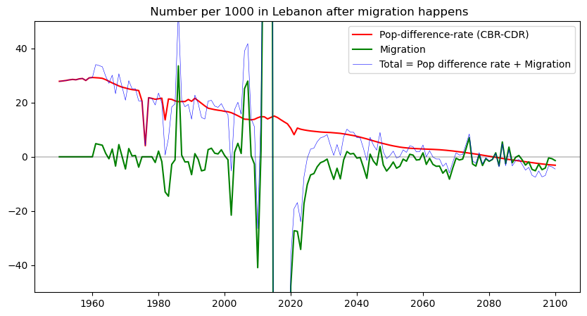

# UN-World-Population-Prospects: Lebanon-Population-Analysis

Project Title: UN World Population Prospects 2024 - Lebanon Population Analysis  

**1. Introduction**

This project analyzes Lebanon's demographic evolution using UN World Population Prospects 2024 (Medium Variant).

**2. Data Source**

Official source: https://population.un.org/wpp/

File: WPP2024_Demographic_Indicators_Medium.csv

**3. Main Objective**  

To analyze population trends for Lebanon using official UN WPP data, understand how Lebanon’s demographics changed from 1950 to 2023 and what the UN projects until 2100.  

**4. Data and Features Chosen**

  Chosen features - efficient minimal set covering demographic balancing equation:

- Time: Year 1950-2100
- TPopulation1July: Total population in thousands (mid-year)
-  PopGrowthRate: Annual growth %
-  MedianAgePop: Median age - aging indicator
-  TFR: Total Fertility Rate - average kids per woman - MOST IMPORTANT
- LEx: Life Expectancy at birth
- CBR: Crude Birth Rate - births per 1000 people
- CDR: Crude Death Rate - deaths per 1000 people
- NetMigrations: Immigrants - Emigrants (negative = people leaving)

**5. Specific Objectives**

To answer:

- How did Lebanon's total population change from 1950-2026 ? When was the fastest growth?
- What is the UN scenario Immigration projection for Lebanon 2030, 2050, 2100?
- Is Lebanon getting older? (MedianAgePop)
- How does Lebanon compare to World for Total fertility rate (TFR) and  World average rate (LEx) ?  
- How did fertility rate (TFR) drop?
- Are the fertility rate (TFR) and median age(MEdianAgePop) related ?
- How the Crude Birth rates and Death Birth Rates are changing, and is there population growth or depopulation?
- How the migration numbers in Lebanon got affected from 1950 till 2026, and what did the UN project about migration numbers for the future?
- Will the miration numbers for Lebanon fill the depopulation gap in the future ?

**6. Methodology**  

Tools: Python, pandas.  
Choosed Lebanon from the table of UN measurements by Filtering ISO3 = LBN, then cleaned, visualized, analyzed, and concluded.

**7. Analysis and Output**  
11 charts (population curve, median age, fertility, life expectancy, comparison with World records, population growth rate, immigration)  

### 8.1 Population Growth Analysis 1950-2026

How did Lebanon's total population change from 1950-2025? When was the fastest growth?

Key insight:  
1950        ~1.36M   
2016 peak   ~6.23M (including refugees)  
2023        ~5.8M. Fastest growth was in 2012-2014.

### 8.2 UN Population Projection 2030, 2050, 2100

What does UN project about populationfor 2030, 2050, 2100?

### 8.3 Age Structure Analysis

Is Lebanon getting older?

Finding:  
The country is becoming older with time:  
1950             ~18y  
2023             ~31y  
2100 projected   ~48y.

### 8.4 Lebanon vs World Comparison: Fertility & Life Expectancy  
**Fertility Rate Per Woman: TFR**  
Comparing Lebanon vs World for fertility rate: TFR   
How does Lebanon compare to World for Total fertility rate (TFR) and  World average rate (LEx) ?

  

Findings of Lebanon records:  
Phase A:  1950-1965 High and stable ∼5.8 Pre-transition  
rural society  
low contraception.
  
Phase B:  1965-1990 Rapid decline from 5.8 to 3.4  
This is the main drop  
Due to:  
Female education + Beirut urbanization  
Later marriage age - civil war 1975-1990 delayed family formation  
Contraception access  
Economic cost of children rising  
Phase C: 1990-2008  
Below replacement from 3.4 to 2.1  
Post-war, economic crisis, more women in workforce. Lebanon reached 2.1 (replacement level) around 2005.
  
Phase D: 2008-2023 Stable low ∼2.2-2.4  
Slight bump 2008-2015 due to relative stability, then flat. Now slightly below replacement.

**8.5 Life Expectancy at Birth: LEx**  
Comparing Lebanon vs World for Life Expectancy at birth: LEx

  
  
How did LEx improve?
  
1950-1974: Increase from 60 To 66 years  
slow improvement, better healthcare, vaccines, less infant mortality.  
CRASH 1: 1975-1976: Dropped to 37 years  
Start of Civil War. This is not biological, it's mortality spike from war deaths. CRASH 2: 1982: Dropped to 46 years  
Israeli invasion of Lebanon, siege of Beirut.  
1990-1991: Jumped from 64 to 71 years  
End of civil war. Healthcare system rebuilt, mortality drops instantly.  
1991-2019: Inclined from 71 to 78.5 years  
Steady increase due to modern hospitals, lower infant mortality, better living standards.  
CRASH 3: 2020-2021: Declined 78.2 To 73.5 years - COVID-19 + Beirut port explosion (Aug 2020) + economic collapse.

  
Summary - Lebanon vs World LEx 1950-2023:
  
1950-1974  
Pre-war: Lebanon always +10y above World (60 vs 46.5). Stable growth.  
1975  
Civil War Start: LEx Lebanon crashes from 66.5 to 36.5y. Falls below World for first time.  
1982  
Israeli Invasion: Second crash from 60 to 47y. Again below World.  
1990-2019  
Post-war: Fast recovery to 78y. Gap with World shrinks from 13y to 5y - Lebanon gain advantage above the world  
2020-2021  
Lebanon dropped from 78.1 to 73.5y due to COVID + Port Explosion + Economic Crisis  
World dropped from 72.4 to 71y due to pandemic.  
Lebanon drop is 3x larger.  
2022-2023  
Lebanon Rebound to 77.9y.

### 8.6 How did fertility rate (TFR) drop?  
 
  
What is TFR of 2:1 ? It means each 2 parents are having 1 child, that is : replaced by one child.  
Why 2.1 and not 2.0?  
Parents need 2 children to replace them 0.1 extra because some children don't survive to adulthood, and slightly more boys are born than girls  
If TFR > 2.1 = each generation is bigger than the last    
If TFR < 2.1 = each generation is smaller than the last  
If TFR = 2.1 = population exactly replaces itself  

Once it is 2.1 for 25+ years, society can never recover because there is fewer mothers in the next generation.  

### 8.7 Are the fertility rate (TFR) and median age(MEdianAgePop) related ?  

  
We notice that the median age is inversly proportional to Fertility rate. And by lgic when no new borns are increasing, the median age increases.
So the median age increase is a consequence of decline in fertility rate.  

### 8.8 How the Crude Birth rates and Death Birth Rates are changing, and is there population growth or depopulation?

  
Why: Populaton difference rate = births - deaths per 1000.    
If this is >0, population grows naturally. If <0, more people die than are born.  
At 2081, depopulation started.

### 8.9 How the migration numbers in Lebanon got affected from 1950 till 2026, and what did the UN project about migration numbers for the future?

    
2019 economic crisis starts  
Banks freeze dollars  
Lira devalues 90%, this means People WANT to leave but CAN'T afford ticket + visa.  
So outflow drops from -270 to -150.  
2020-2021  
COVID travel bans  
Airports closed. Both in and out = 0. Net rate goes from -250 to -30 automatically because Immigrants = 0 and Emigrants = 0, so Net = 0.  
2022+  
UN projection smooths to 0  
UN WPP 2024 assumes migration returns to normal long-term average -0.9 per 1000 So they model it as flat near 0  

### 8.10 -  Will the miration numbers for Lebanon fill the depopulation gap in the future ?

  

Total growth = Pop-difference-rate + Migration.  
For 2024-2100  
UN projects 0 Migration, but Pop-difference-rate goes negative after 2045, so Total stays negative.

### 9 Conclusion  
-Lebanon experienced rapid population growth until 2016 due to natural increase and refugee inflow, followed by decline due to imigration and low fertility.  
-Fertility dropped from 5.8 to below replacement 2.1 around 2005.  
-Life expectancy showed war-related crashes that match Lebanese history.  
-Age structure is shifting from youthful to aged, which will increase the old-age dependency ratio.  
-Migration won't fill the gap of depopulation, and the population growth won't absorb migration loss, but increases it instead.

## 10. Repository Files
- UN_Data_Analysis.ipynb
- WPP2024_Demographic_Indicators_Medium.csv
- Chart1 to Chart11
- README.md
